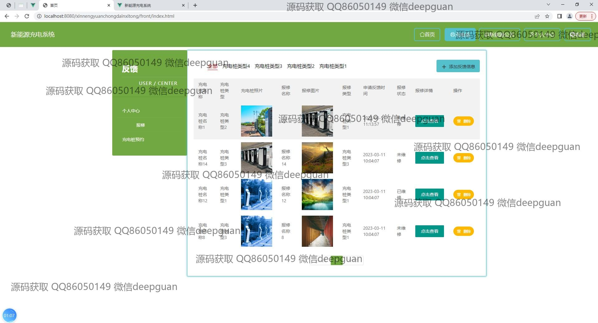

<h1 align="center">新能源充电系统</h1>

## 简介
新能源充电系统：角色分为管理员、用户；功能包括充电桩管理、用户管理、报修管理、新能源公告、预约充电和客户反馈，支持地图导航、账户信息管理及交流功能。    --计算机毕业设计源码；毕设源码；java毕业设计源码

## 联系方式

<h3 align="center">获取完整代码与数据库文件 + 微信：deepguan QQ: 86050149 QQ群: 783742310</h3>

<h3 align="center">可帮忙远程部署 包运行成功！提供远程部署、修改代码、设计文档指导、代码讲解等服务！</h3>

## 功能介绍（完整见运行截图）
管理员：管理员可以访问并管理新能源充电系统的多种模块，包括用户管理、充电桩管理、报修管理和新能源公告管理等功能，支持用户信息修改、密码重置、充电桩状态更新、报修信息处理以及公告的新增、修改和删除。通过管理界面，管理员可查看所有充电桩的详细信息，进行数据筛选与分页浏览，以便充分掌握系统运行情况并作出及时调整。用户：用户通过系统可以完成注册、登录并访问各种功能模块，如查阅充电桩信息、预约充电、提交报修请求和管理个人资料。用户中心提供查看和编辑个人信息的功能，包括昵称、联系方式及账户余额，并可通过地图查找附近充电站与目前可用的充电桩，用户还可以及时预约并管理其充电历史记录。

## 运行截图

本代码来源于网络,仅供学习参考使用!

